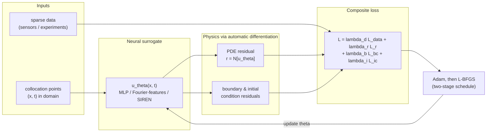
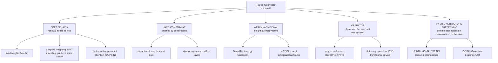

# Comparative Analysis — How PINN Papers Actually Work

**Status:** anatomy and taxonomy complete; comparison tables populated from the master
inventory (`data/paper-inventory.csv`) as scout slices land. Last updated: 2026-10-06.

> Companion figures: `figures/fig2_domain_mechanism.png` (mechanism × domain),
> `figures/fig3_mechanism_bar.png` (mechanism counts).

## 1. Anatomy of a PINN

Every physics-informed neural network, whatever its branding, is built from the same four
moves. Reading a new PINN paper is mostly identifying where it deviates from each move.

1. **Represent** the unknown field with a neural network $u_\theta(x,t)$ (usually an MLP,
   increasingly with Fourier features or periodic activations to fight spectral bias).
2. **Differentiate the network** with automatic differentiation to form the PDE residual
   $r = \mathcal{N}[u_\theta]$ — this is what makes the network "physics-informed" without
   mesh generation.
3. **Penalize or constrain**: minimize a composite loss over collocation points — data
   misfit + PDE residual + boundary/initial conditions (or impose the conditions exactly).
4. **Optimize** with a two-stage schedule (Adam for the rugged early landscape, L-BFGS for
   the fine refinement), on sampled collocation points that may be resampled adaptively.

**Inverse problems** reuse the identical loop with physical parameters (viscosity,
diffusivity, reaction rates) promoted to trainable variables — the dominant problem class
in industry-facing papers.

**Operator learning** changes the object: instead of one solution $u$, the network learns
the map (input function → solution function). Physics enters as residuals evaluated on the
operator's output (physics-informed DeepONet, PINO) or as fine-tuning on multi-PDE corpora.

## 2. Enforcement-mechanism taxonomy

**What the corpus says (interim):** soft penalty dominates everywhere; weak/variational and
energy forms are the strongest alternatives for low-regularity or high-dimensional PDEs;
hard constraints remain rare and appear mostly as output-transform tricks; operator
learning is the fastest-growing and most-cited branch. (Counts: `fig3_mechanism_bar.png`.)

## 3. Loss weighting & training-strategy comparison

_Populated from inventory after slice A consolidation._ Structure:

| Method | Core idea | Best against | Reference (inventory ID) |
|---|---|---|---|
| Fixed weights (vanilla) | manual λ tuning | — baseline | PINN-A0x |
| NTK-based annealing | weight terms by empirical neural tangent kernel | gradient pathologies | PINN-A0x |
| Gradient-norm balancing | keep loss-term gradients equal magnitude | stiff multi-term losses | PINN-A0x |
| Self-adaptive attention | per-collocation-point trainable weights | stubborn local residuals | PINN-A0x |
| Causal training | enforce time-causality of residuals | long-time integration | PINN-A0x |
| Curriculum (sequential) | simple→hard PDE terms in stages | non-convex failure modes | PINN-A0x |

## 4. Architecture comparison

_Populated from inventory (slice B)._ Structure: MLP baseline; Fourier-feature MLP;
SIREN; modified MLP; domain-decomposed (cPINN/XPINN/FBPINN); DeepONet family; FNO family;
transformer operators (GNOT/Transolver line); Bayesian; diffusion hybrids.

## 5. Software frameworks & benchmarks

_Populated from inventory (slices A, F)._ Structure: DeepXDE, NVIDIA Modulus/PhysicsNeMo,
SciANN, jaxpi/Adam, PINNacle, PDEBench, PDEArena — with language, physics coverage, and
industrial backing columns.

## 6. Domain × physics × enforcement master table

_Populated from inventory (slices C–F)._ This becomes Table T3 of the manuscript:
one row per domain exemplar — exact PDEs enforced, mechanism, problem class (forward /
inverse / operator), evidence level (simulation vs experimental vs deployment).
