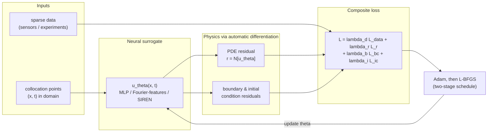
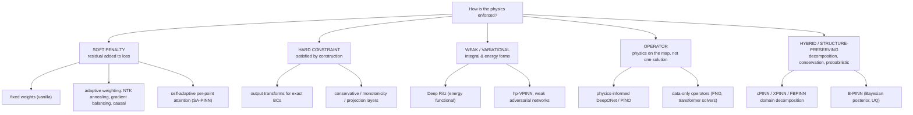

# Comparative Analysis — How PINN Papers Actually Work

**Status:** complete for slices A–F (106 verified papers); slice G (survey landscape)
lands in `docs/04-findings-and-conclusions.md` §RQ4. Last updated: 2026-10-07.

> Companion figures: `figures/fig2_domain_mechanism.png` (mechanism × domain),
> `figures/fig3_mechanism_bar.png` (mechanism counts). IDs refer to
> `data/paper-inventory.csv`.

## 1. Anatomy of a PINN

Every physics-informed neural network, whatever its branding, is built from the same four
moves. Reading a new PINN paper is mostly identifying where it deviates from each move.

1. **Represent** the unknown field with a neural network $u_\theta(x,t)$ (usually an MLP,
   increasingly with Fourier features or periodic activations to fight spectral bias).
2. **Differentiate the network** with automatic differentiation to form the PDE residual
   $r = \mathcal{N}[u_\theta]$ — this is what makes the network "physics-informed" without
   mesh generation.
3. **Penalize or constrain**: minimize a composite loss over collocation points — data
   misfit + PDE residual + boundary/initial conditions (or impose the conditions exactly).
4. **Optimize** with a two-stage schedule (Adam for the rugged early landscape, L-BFGS for
   fine refinement), on collocation points that may be resampled adaptively.

**Inverse problems** reuse the identical loop with physical parameters (viscosity,
diffusivity, reaction rates) promoted to trainable variables — the dominant problem class
in industry-facing papers.

**Operator learning** changes the object: instead of one solution $u$, the network learns
the map (input function → solution function). Physics enters as residuals evaluated on the
operator's output (physics-informed DeepONet, PINO) or as fine-tuning on multi-PDE corpora.

## 2. Enforcement-mechanism taxonomy

**What the corpus says:** soft penalty dominates everywhere (fig3); weak/variational and
energy forms are the strongest alternatives for low-regularity or high-dimensional PDEs
(hp-VPINN B08, WAN B11, Deep Ritz B02, elastoplasticity weak forms F05); hard constraints
were rare until 2024–2026, when they became the clearest trend (conservative climate
layers D16, KCL projections D04, monotonicity constraints E04); operator-side enforcement
grows with operator learning's citation dominance (B14/B15).

## 3. Loss weighting & training-strategy comparison

| Method | Core idea | Best against | Inventory refs |
|---|---|---|---|
| Fixed weights (vanilla) | manual λ tuning | — the baseline everything else compares to | A01 |
| Learning-rate / NTK annealing | weight loss terms by empirical NTK dynamics | gradient pathologies, competing terms | A04, A06 |
| Self-adaptive attention | per-collocation-point trainable weights | stubborn local residuals | A07 |
| Balanced residual decay | match residual decay rates across terms | slow-to-vanish terms (PDEs + operator nets) | A19 |
| Residual-based adaptive sampling | resample where residual is large | localized sharp features | A08 |
| Curriculum (sequential training) | simple→hard PDE terms in stages | non-convex failure modes | A03 |
| Causal training | enforce time-causality of residuals | long-time / chaotic integration | A16 |
| Two-stage optimizer schedule | Adam then L-BFGS | the community default backbone | A10 |

## 4. Architecture comparison

| Family | Representatives | Where it wins | Watch out | Inventory refs |
|---|---|---|---|---|
| Vanilla MLP | original PINN | simplicity, inverse problems | spectral bias; training pathologies | A01 |
| Fourier-feature MLP | random/learned Fourier features | multi-scale, high-wavenumber PDEs | eigenvector bias if mis-set | A05 |
| SIREN (periodic activations) | implicit neural representations | sharp features, waves | init sensitivity | B01 |
| Modified MLP | per-layer input transforms | gradient pathology mitigation | — | B04 context, A04 |
| Domain decomposition | cPINN, XPINN, FBPINN, multilevel-DD | large/complex domains, conservation at interfaces | interface consistency; complexity | B06, B07, B09, B10 |
| Weak/variational nets | Deep Ritz, hp-VPINN, WAN, weak+strong elastoplasticity | low regularity, high dimensions | needs variational setup | B02, B08, B11, F05 |
| Operator: branch-trunk | DeepONet, PI-DeepONet | parametric families, real-time inference | needs operator data | B12, B14 |
| Operator: spectral | FNO, PINO | grids, fast rollouts, physics fine-tuning | regular geometries | B13, B15 |
| Operator: transformers | GNOT, Transolver(+), Poseidon | general geometries, million-scale meshes, multi-PDE pretraining | compute cost | B16, B17, B18, B20 |
| Bayesian / UQ | B-PINN | noisy data, certified uncertainty | costly posteriors | B19 |
| Generative hybrids | physics-informed diffusion | sampling under constraints | young (2025) | B21 |
| KAN-based | KAPNet | constraint-friendly backbones | young (2025) | D14 |

## 5. Software frameworks & benchmarks

| Tool | Role | Backing | Inventory refs |
|---|---|---|---|
| DeepXDE | most-used PINN library (user-specified residuals, hard+soft BCs) | academic (SIAM Review) | A09 (=F12) |
| SciANN | Keras/TF wrapper; used in early solid-mechanics PINNs | academic (CMAME) | F13, E01 |
| jaxpi | JAX reference implementations + "expert's guide" defaults | academic (arXiv) | A10 |
| NVIDIA Modulus → PhysicsNeMo | GPU-scale industrial framework (PINN + FNO hybrids); Siemens Energy digital-twin case study | vendor (marked webpage, unverified) | F14 |
| PINNacle | comprehensive PINN benchmark (20+ PDEs) — no method dominates | academic | A11 |
| PDEBench / PDEArena | scientific-ML benchmark suites incl. operator settings | academic (NeurIPS D&B) | A12 |

## 6. Domain × physics × enforcement (exemplar table → manuscript Table T3)

| Domain group | Exemplar IDs | Exact physics enforced | Mechanism | Problem class |
|---|---|---|---|---|
| Fluids & aerospace | C01, C04, C05, C06, C10 | incompressible NSE; RANS; compressible Euler | soft residual; hard BC + distance features; artificial dissipation at shocks | forward + inverse |
| Thermal | C03, C12, C14, C15 | conduction/convection/radiation; conjugate HT; film-cooling superposition | soft residual; correlation-as-physics | forward + inverse |
| Power & energy | D01, D02, D04 | swing equations; AC power-flow (Kirchhoff) | soft penalty → hard projection layers | both + control |
| Batteries | D06, D07, D08 | P2D/DFN PDEs; Butler–Volmer; degradation laws | soft residual; hybrid empirical+physics | inverse + forecasting |
| Nuclear | D12, D13 | point-kinetics ODEs | soft penalty + transfer learning | forward |
| Climate | D16, D17 | conservation (mass/energy) laws; full dynamical core | hard conservative layers; hybrid physics-core | operator/emulation |
| Renewables | D14, D15 | wind-evolution physical constraints | hybrid constraint loss | forecasting |
| Biomed | E05, E06, E07, E08, E10, E11 | Monodomain+ionic; Eikonal; hyperelastic energy; reduced-order flow; reaction–diffusion; Windkessel ODEs | soft residual; energy-functional loss; ROM hybrid; meta-learning | inverse (clinical) |
| Geoscience | E02, E03, E04 | acoustic/elastic wave; Biot; Richards | soft residual; monotonicity constraints | both |
| Civil | E01, E13, E14, F04 | linear elasticity; soil–structure; MDOF dynamics; elastoplasticity | soft residual (SciANN); constitutive-residual losses | both |
| Materials & mfg | F01, F03, F05 | phase-field fracture; melt-pool NSE+heat; von Mises J2 | residual + transfer learning; strong+weak forms | forward |
| Finance | F10, F11 | Black–Scholes-class; HJB | deep Galerkin residuals; adaptive sampling | forward/pricing |
| Cross-cutting methods | A01–A20, B01–B23 | generic PDE residuals / benchmarks / theory | all of the above | theory & training |

Full per-paper detail: `data/paper-inventory.csv` + `research-notes/slice-*.md`.
